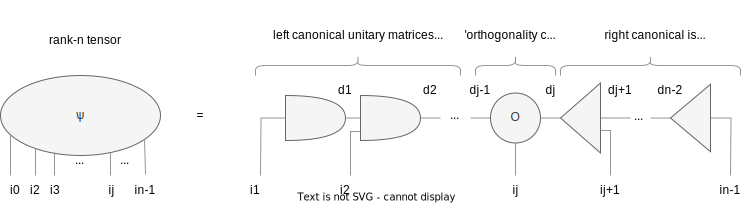
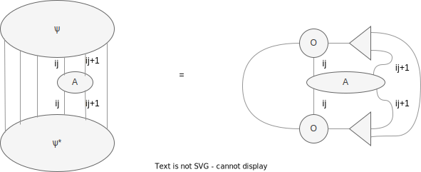

#Tensor Networks

Implementations of 1D tensor networks algorithms in python.

## MPS decomposition 
Basic tensor network algorithm that decomposes an n-rank tensor into a mixed canonical matrix product state (MPS). 
In diagrammatic form, it looks like this

This form of representing many-body states allows us to perform useful calculations.For example, we can easily calculate 
expectation values of one-site local operator

or two-site 

## MPO based algorithms 

A lot of Hamiltonians from many-body quantum mechanics can be represented using matrix product states. This representation 
is called a Matrix Product Operator (MPO) and is useful for calculating expectation values in a given MPS state or finding 
eigenstates of the operator. As an example, I have used the Quantum Transverse 1D Ising Model (QTIM) Hamiltonian in my code

### Expectation value

Expectation value of the MPO in a given MPS state 

can be efficiently calculated using following scheme

### Lowest eigenstate of the MPO Hamiltonian

To find eigenstate of our MPO we are gonna minimize <A|H|A> with respect to the  bra <A| by zeroing corresponding 
derivative (A is a random state MPS in a mixed canonical gauge). It will lead to an eigen problem in a tensor form

  

The main part of the algorithm for finding the lowest eigenstates involves an iterative minimization process, where each
matrix product state A^k (represented in vectorized form) is minimized using the Lanczos algorithm. The Lanczos algorithm 
is a numerical method used to find the lowest eigenstate of a matrix. In the first left and right sweeps, we start with 
previously calculated L and R tensors. After each Lanczos step, we update these tensors using the following scheme:

  

(similar procedure for R).

After a few sweeps it will converge, and we will obtain lowest eigenstate of our MPO.

## Roadmap

Main goals for now (in priority order):

- [x] MPS decomposition algorithm 
- [ ] MPO Lanczos based algorithms 
- [ ] TDVP
